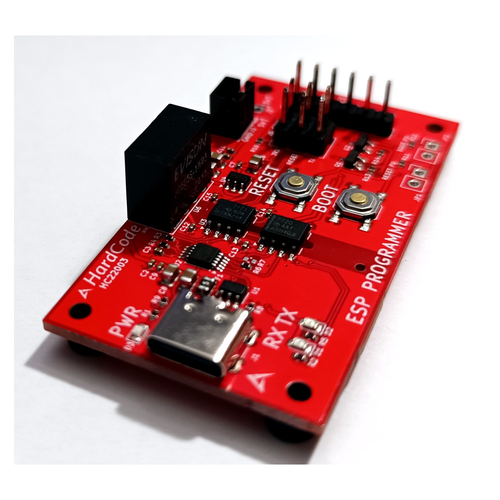

# USB-C ESP Programmer — Isolated (HC22003)

A **galvanically isolated** USB-C-to-UART programmer for the **ESP8266 / ESP32** series.
Everything the [HC22002](https://github.com/hardcodebr/usb-esp-programmer) does — USB-to-UART
bridging plus **automatic reset & boot** — with an **isolation barrier** between your PC and the
target (digital isolator on data + isolated DC-DC on power).

> 🛒 **Buy:** https://lectronz.com/products/galvanically-isolated-esp-programmer-auto-reset
> 🔌 Don't need isolation? See the [non-isolated HC22002](https://github.com/hardcodebr/usb-esp-programmer).

## Why isolated?
For **mains-referenced boards, high-voltage front ends, different-ground targets, or
ground-loop-prone setups** — it protects your laptop and gives clean, reliable flashing
where a non-isolated adapter would be risky. Most ESP programmers are *not* isolated.

## Features
- **Galvanic isolation** — digital isolator (data) + isolated DC-DC (power)
- **USB-C** host interface
- **Automatic reset / auto-boot**; on-board **RST** + **BOOT** buttons
- Works with **esptool, Arduino IDE, ESP-IDF**
- Supports **ESP8266, ESP32, ESP32-S2/S3, ESP32-C3**

## Documentation
- [Quick-Start](docs/index.md) · [Datasheet](docs/datasheet.md) · [Pinout](docs/pinout.md) · [FAQ](docs/faq.md)

---
Made by [HardCode](https://hardcode.com.br) · support@hardcode.com.br
*Hardware design files are not published.*

## 💬 Feedback
Suggestions or questions → [open a discussion](https://github.com/hardcodebr/usb-esp-programmer-isolated/discussions) · support@hardcode.com.br
